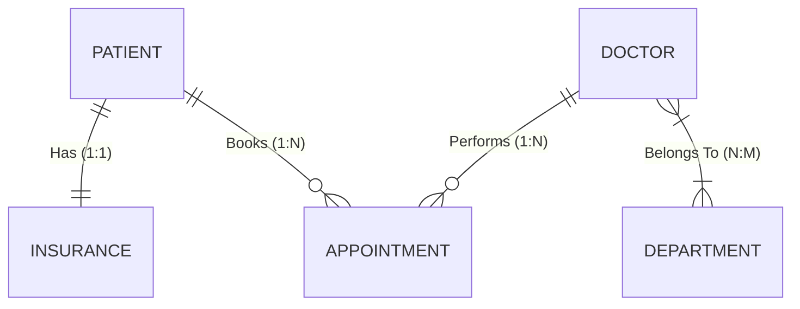

# Hospital-Management-System-Spring-Boot-JPA

[](https://www.oracle.com/java/)
[](https://spring.io/projects/spring-boot)
[](https://hibernate.org/)


A comprehensive backend demonstration of **Spring Data JPA** and **Hibernate** capabilities. This project implements a hospital management domain to showcase advanced database mapping strategies, including **One-to-One**, **One-to-Many**, and **Many-to-Many** relationships with strict cascade and orphan removal policies.

---

## 📖 Table of Contents
- [Architecture & Design](#-architecture--design)
- [Key Features](#-key-features)
- [Tech Stack](#-tech-stack)
- [Project Structure](#-project-structure)
- [Getting Started](#-getting-started)

---

## 🏛 Architecture & Design

The database schema is designed to enforce data integrity at the persistence layer.

### Entity Relationship Diagram (ERD)


### Relationship Logic

| Relationship | Logic Applied | Description |
| --- | --- | --- |
| **Patient ↔ Insurance** | `CascadeType.ALL`, `orphanRemoval=true` | Strict composition. If a patient is removed, their insurance policy is automatically deleted. |
| **Patient ↔ Appointment** | `CascadeType.REMOVE` | Data cleanup. Deleting a patient record cascade-deletes their appointment history. |
| **Doctor ↔ Department** | `@JoinTable` | Many-to-Many mapping using an intermediate join table `my_dpt_doctors`. |

---

## 🌟 Key Features

* **Advanced ORM Mapping:** Full implementation of JPA annotations including `@OneToOne`, `@OneToMany`, `@ManyToMany`, and `@JoinColumn`.
* **Lifecycle Management:** Automatic entity state transitions (Persist, Merge, Remove) via cascading.
* **Data Transfer Objects (DTOs):** Separation of concern between the persistence layer (Entities) and the API layer (DTOs).
* **Type Safety:** Utilization of Java `Enums` for fixed data sets like Blood Groups.
* **Lazy Loading:** Optimized database queries using `FetchType.LAZY` for non-critical relationship data.

---

## 🛠 Tech Stack

* **Language:** Java 17
* **Framework:** Spring Boot 3.x
* **Persistence:** Spring Data JPA / Hibernate Core
* **Database:** H2 (In-Memory) / MySQL / PostgreSQL
* **Tools:** Maven, Lombok

---

## 📂 Project Structure

```bash
src/main/java/com/example/JPA_AnujBhaya
├── dto             # Data Transfer Objects (API Layer)
├── entity          # JPA Entities (Database Layer)
│   ├── Appointment.java
│   ├── Department.java
│   ├── Doctor.java
│   ├── Insurance.java
│   └── Patient.java
├── repository      # Spring Data Repositories
├── service         # Business Logic Layer
└── type            # Enums (BloodGroupType)

```

---

## 🚀 Getting Started

### Prerequisites

* Java Development Kit (JDK) 17+
* Maven 3.6+

### Installation

1. **Clone the repository**
```bash
git clone [https://github.com/YOUR_USERNAME/JPA-Healthcare-System.git](https://github.com/YOUR_USERNAME/JPA-Healthcare-System.git)
cd JPA-Healthcare-System

```


2. **Configuration**
Verify database settings in `src/main/resources/application.properties`:
```properties
spring.datasource.url=jdbc:mysql://localhost:3306/healthcare_db
spring.datasource.username=root
spring.datasource.password=yourpassword
spring.jpa.hibernate.ddl-auto=update

```


3. **Build and Run**
```bash
./mvnw spring-boot:run

```


---

for more information.

<div align="center">
<sub>Developed by Sarfaraz Essa </sub>
</div>

```
## 📬 Contact

If you have any questions or want to discuss this project, feel free to reach out!

**Sarfaraz Essa** 📧 Email: sarfarazessa18@gmail.com  
```
